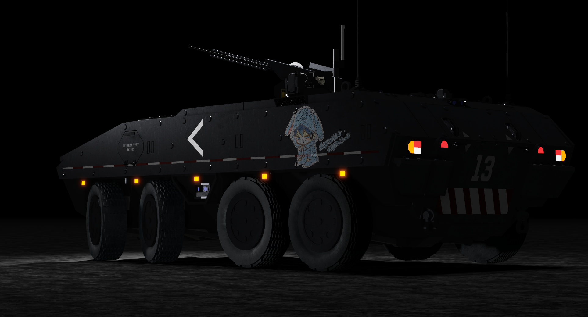
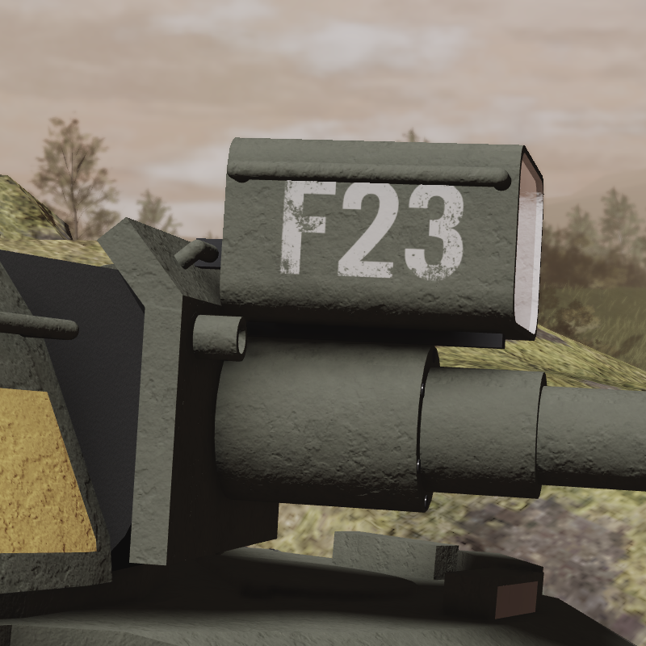
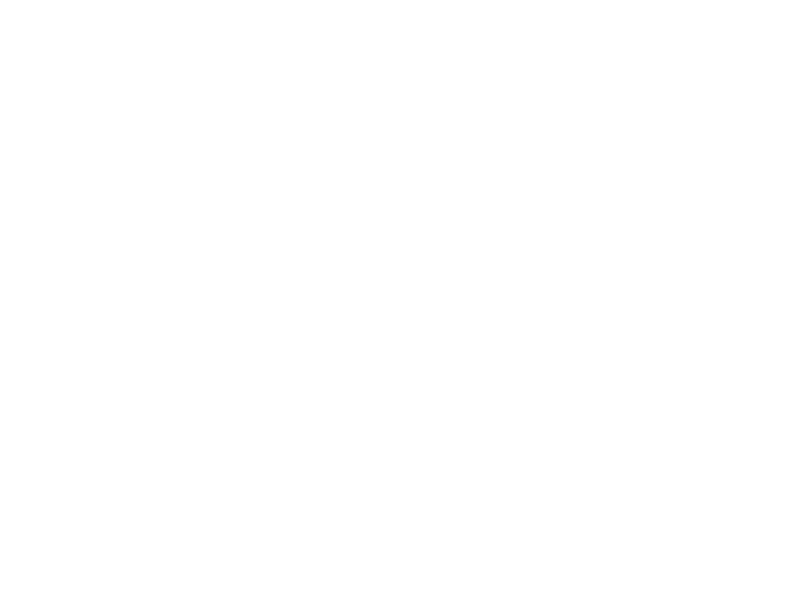
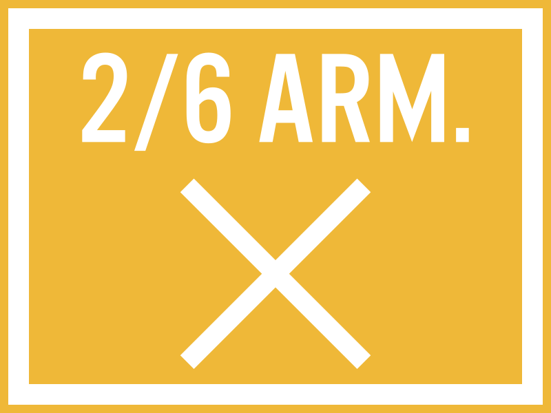
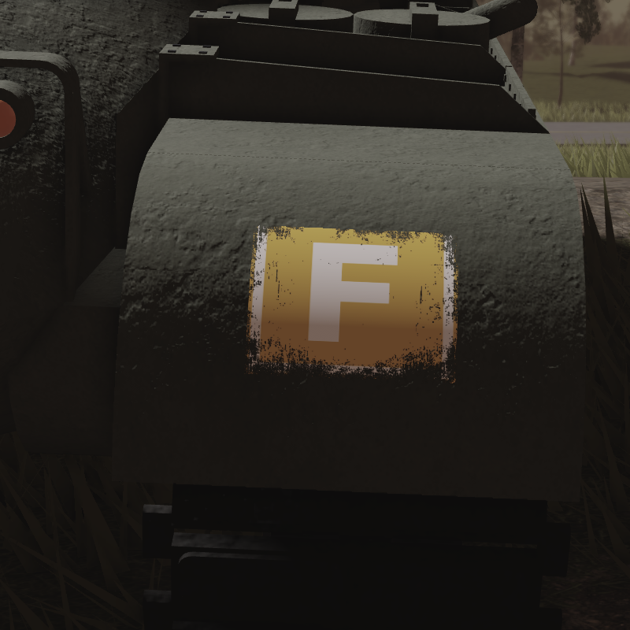

The Glossy Gyaru has some cool textures and markings that I couldn’t really talk about in the Glossy Gyaru in the Midterm Insurgency article.

I was on the verge of detailing the Glossy Gyaru’s unit placement (which corresponds with its markings), but it felt too tangential that I eventually cut it from the main article. Additionally, I wanna maintain an objective, third-person narrative tone when I write mainline posts, so even if I did keep it in, I wouldn’t be able to geek out in-depth about the context, unlike my commentary in these DevLogs. I still want to make a dedicated post about Federation unit markings at some point. But for now, I just want to give a rundown on the Glossy Gyaru, her markings, and a little on why Federation unit compositions are so Brigade-centric.

## Glossy Gyaru

First off— Glossy Gyaru herself. I say “her” as a sort of loving anthropomorphizing, like how ships are referred with female pronouns. Also, as of writing, I’m not sure if Glossy Gyaru would have a tankgirl incarnation or not (I’ve been considering if this catgirl character should be the tankgirl of the Glossy Gyaru). So, consider my referral to the tank as a female as a form of future proofing.

The idea for this tank is quite old, about as old as the MBT-31 itself as a design that I made. I made the MBT-31 in mid-2023, and made [my developer's commentary](https://cwiffie.newgrounds.com/news/post/1369258) of that design on July 1st. And immediately on that post, you see a tank with the name written across the cannon barrel: *“Glossy Gyaru.”*



It was just a random, dumb name I made to put on the tank. I was doing the same to other armored vehicles I was making through 2022 and 2023 — Plastering dumb names, mascots, and insignias onto their hulls to give them each some carefree charm.


  
  
  


(The "Shooter Scooter", "Inali", & "Depresso Expresso")

But even then, the name just kinda stuck. Not that it’s particularly charming, I was just too lazy to dish out any more names. So come this year, once I felt like revisiting some of my old work after committing to *”Wars in Reverie”* as a project title, I wanted to touch up an MBT-31 and give it cool decals. Then, when it came time to put a name on the barrel, what other one to slap on except Glossy Gyaru. Thus how I made the Glossy Gyaru pictured in the main article.

## Unit Assignment

That tangent aside, the Glossy Gyaru’s unit assignment is with the 6th Armored Brigade, 2nd Armored Battalion, Company F, 2nd Platoon, as the 3rd Vehicle.
The markings on the tank correspond to her unit. The regimental colors of the 6th Armored is yellow — and emboldened all across the Glossy Gyaru are those regimental colors: yellow.



The “F23” marking on the gun spotlight denotes “Company F, 2nd Platoon, 3rd Vehicle.”


  
  


Then, there are painted markings on the fenders of the tank. On the left side, it shows “2/6 ARM.” with a cross; The 2 and the cross both denote “2nd Battalion” (the cross has two lines, representing the number two). The “6th ARM.” is an abbreviation for the 6th Armored Brigade.


  
  


Meanwhile, the blocked "F" marking signifies "F Company."


  
  


And no, at time of writing, I haven’t made a 6th Armored Brigade insignia yet. I was really hoping to make one, but I wanted to finalize the main article the same week I had exams, so I just decided to put out the article without the brigade insignia.

This was most definitely the main experiment behind the Glossy Gyaru: I wanted to see how I’d put identifiable markings on a tank. I always wanted to put them on Federation tanks in *Wars in Reverie*. It may look dumb — like a kid’s imagination of what an awesome tank would look like — but that’s kind of the point; It harkens back to my broader project goal of meshing childishness and militarism. It’s anime-esque bright-colors contrasting on single-tone camouflage is purposeful.

More tellingly, the idea isn’t original just to this instance. I’m taking inspiration from my childhood imaginative military, the PMRDD. In there, armored vehicles were also brandished with unit colors, clearly identifying what commands they belonged to.



The idea was, quite literally, what I imagined an awesome tank would like as a kid. The image of bright, anime-esque colors palstered atop a single-tone camouflage hull is what I want to replicate in *Wars in Reverie*. It’s not without its uses either: You can clearly identify a vehicle’s brigade by a glance, and a vehicle’s unit assignment at a stare. Perhaps that would hand too much information to open-source intelligence, but overt unit colors it not a new concept in militaria. The idea of [facing colors](https://en.wikipedia.org/wiki/Facing_colour) on [regimental dress](https://en.wikipedia.org/wiki/Military_uniform#European_regimental_dress) has existed in Europe since the 18th century. So, the idea of the Federation military still using regimental colors prominently isn’t a fantastical one. Just as it was in the past, it still has some uses to immediately identify your unit to friendly and foe — no matter how little the utility it grants. More than anything, I think such an implement adds pride and esprit-de-corps to a unit with its own colors. Which, yes, implies that there will indeed be Federation army units without regimental colors (“colorless units”). But the idea of regimental colors is very intricate, which I’d want to eventually devote to its own article.

## Brigade-centric Identification

This too is another idea that I’d want to devote to its own article, but I want to spend this follow section to quickly ramble on this topic.
The Glossy Gyaru — and also the helmets of her accompanying infantry — has yellow paint to denote itself to the 6th Armored Brigade, because the 6th Armored has yellow as its regimental colors. But why should Brigade-level units be given colors? And why are individual elements (like tanks and infantry) identifying themselves with their Brigade? The U.S. Army historically denoted its elements to the Division-level since WWI, so why aren’t the Federation doing the same?

Well historically (in real life), military formations identified themselves to the regiment first. When you read historical accounts of the U.S. Civil War, the units on the field were maneuvering as part of regiments, or brigades consisting of regiments. The regiment was the highest-level unit of specialized soldiers — There were infantry regiments, cavalry regiments, and artillery regiments. If you asked any soldier what unit they belonged to, they’ll give you their regiment (8th New York Infantry, 3rd Indiana Cavalry, etc.). It wasn’t until WWI when U.S. Army units [started embroidering](https://en.wikipedia.org/wiki/Shoulder_sleeve_insignia#Colored_shoulder_sleeve_insignia) their division patch onto their doughboy fatigues. Then in the mid-20th century, when the U.S. Army transitioned to Brigade Combat Teams, the conept of regiments as a field unit became a footnote.



Instead, the Federation Army is to take a different path: If regimental colors in the early modern era were entrenched as part of unit identity, perhaps it could stay with that unit onto the future. Instead of divisions usurping unit identity during the transition to Brigade Combat Teams, the regiment itself was transformed into a brigade format whilst preserving the regimental colors and esprit-de-corps. Thusly, onto the modern day, Federation soldiers continue to wear their colors proudly. Divisions and superior commands are still necessary, but individual elements shall immediately identify themselves to their regiments and brigades.

The best comparison would be to the Clone Troopers in Star Wars, and how troopers adorn themselves with custom colors depending on their unit (501st Legion, 327th Star Corps, etc.). But with more grounded reasoning, using that aforementioned history of military regiments.



Despite that Star Wars comparison, that was not my source of inspiration. I was inspired, yet again, by the PMRDD. Units in the PMRDD had their own colors and insignia, which was conspicuously put onto vehicles and uniforms.

This had its own history, too. I originally implemented the idea in 2016, when the PMRDD had countless players as members and I wanted to organize them into fireteams (4-player units). Given how small Blocksworld’s playerbase was, 4-person units seemed to be an adequate unit size. Each of those fireteams was given a unique color and insignia combination.



Then later in 2018, when the Blocksworld Military Community became less player-centric, I changed the organization to have battalion-sized units and higher to be given colors.



It’s a cute little idea that I wanted to carry on into *Wars in Reverie*. As I’ve said in the last section, it’s a silly idea but it does indeed have utility. Even if it’s no longer of practical use in the field, it can still serve as a point of pride for the regiments and brigades that brandish their unique colors.
I’ve written much more than I originally intended, but I still want to give this topic its own dedicated article. Regimental colors, esprit-de-corps, and the anime-esque look to it are all points worth explaining further with better devotion.

But for now, just know that these were all the contexts that revolved around the Glossy Gyaru, and what her markings all symbolize.

## Links

*Main post:*


*Media article:*
