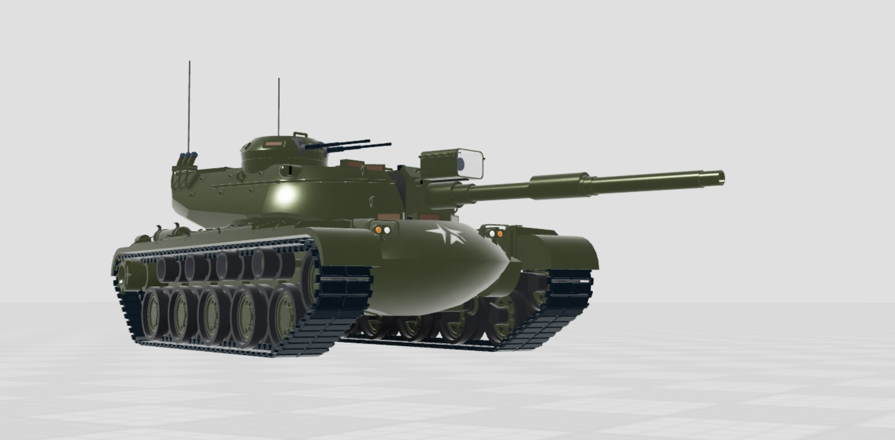
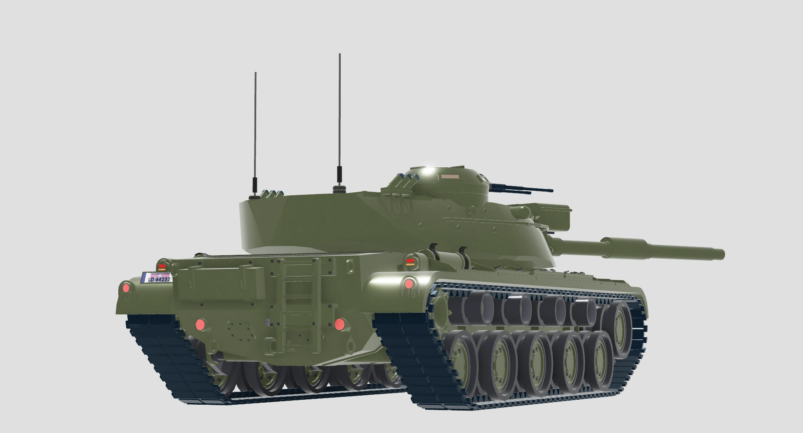

+++
date = '2025-08-26T11:06:02-05:00'
draft = false
title = 'MBT-31 Foxtrotter'
content = ["📰 Posts"]
factions = ["federation"]
mediums = ["roblox"]
+++


This article is a republication of the original, published on Newgrounds on July 1st, 2023.


The MBT-31 was introduced into Federation service in 1962, originally designated the "MT-31" or "Medium Tank, Model 31." At the time, Federation armored doctrine was still in transition to the Main Battle Tank doctrine; The MBT-31 was caught in the middle of such transition, thus was originally considered a Medium Tank, in comparison to the heavy breakthrough tanks that were still employed at the time.


  <!--  -->
  
  
  


The MBT-31 was never designated a name nor officially carries a namesake. However, the tank soon adopted the colloquial nickname the "Foxtrotter," named after a Federation breed of hunting horse. Many Federation tanks are nicknamed after horses, in respect to armored doctrine's roots in horse cavalry. In the absence of any official name for the MBT-31, the "Foxtrotter" stuck as part of the tank's identity.

As the Federation Army's Armored Corps committed fully into the Main Battle Tank doctrine, the MBT-31 was mass-produced on a wide scale beginning in the 1970's, both to replace the Federation's aging heavy tanks, and to export to other allied countries. As a result, the MBT-31 became one of the most mass-produced and widely circulated armored fighting vehicles in the developed world today.

The MBT-31 served for a long four decades in frontline service, the longest service of any armored vehicle; Even longer than its replacement and the Federation's current main battle tank, the MBT-37 Blackfoot. The Federation pulled MBT-31 from frontline units in 1989, and all federal active-duty units by 1997, replaced by the MBT-37. Regardless, the proven reliability and versatility of the MBT-31 meant that the Federation keeps large stocks of the vehicles to this day, either for use in the National Militia or for export to friendly nations.

<!-- More MBT-31 artwork here:
 -->